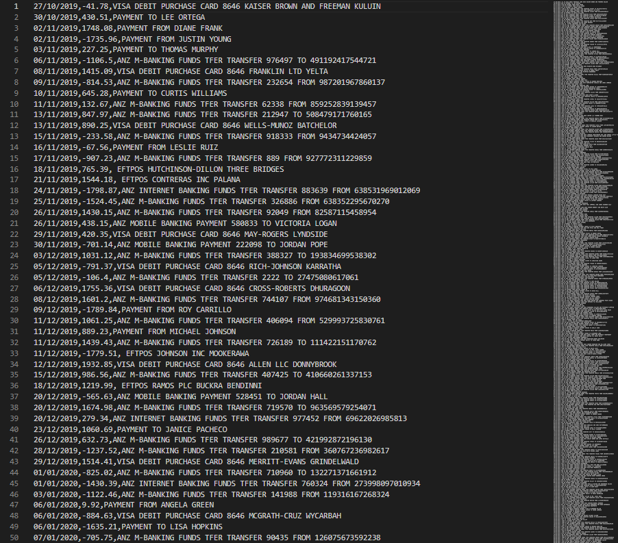

## Generating Fake Bank Data

### Protecting the private information of the developers.

---

The CSV_Generator emulates the CSV downloads from the 4 major Australian Banks.

The code makes use of python library called `faker` to generate fake transaction information.

The CSV files will be used to test the CSV reader.

---

## Example of ANZ CSV

---