# Forecast portfolio return with users' investment options
This part of the project will use Monte Carlo simulation and a few financial formulas to forecast users' portfolio return based on their investment preferences.

## **1. Users' portfolio construction**
It is assumed that the users' portfolio is constructed by the US Aggregated Bond Index and S&P500. The % of each index will be decided based on users' risk preference and age. 

The project applied "Rule of 100" to decide the base % of investing in bonds and stocks indexes. This rule is generally used to make investment decision based on age of the investors (Brock, 2022). For instance, if the age of the user is 30, then the portion of the fund to invest in stock is 70% (100 - 30).

Then the program will take users' risk preference input to modify the % of the portfolio construction. The users have the option to choose either "High" (Risk seeker) or "Mid" (Risk Neutral) or "Low" (Risk adverse). If the risk preference is "Mid", the % of bonds and stock portions is the same as the base %. If the preference is "High" or "Low", the % invest in stock will be increase or decrease by 10%, respectively.

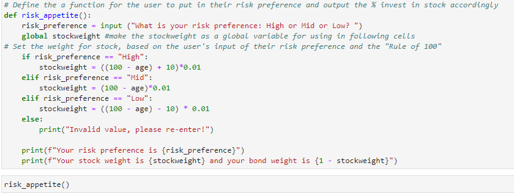

The available fund is inputted into the program by users, at their discretion.

## **2. Monte Carlo Simulation**
Monte Carlo Simulation (MCS) is used to forecast the return of the users' portfolio in 5 years. 

### *Data collection*
Closing prices of the US Aggregated Bond Index and the S&P500 are collected via the Alpaca API, under the tickers named AGG (the US Aggregated Bond Index) and SPY (index mimicking S&P500). These prices are collected in the last five years in order to create a more reliable forecast.

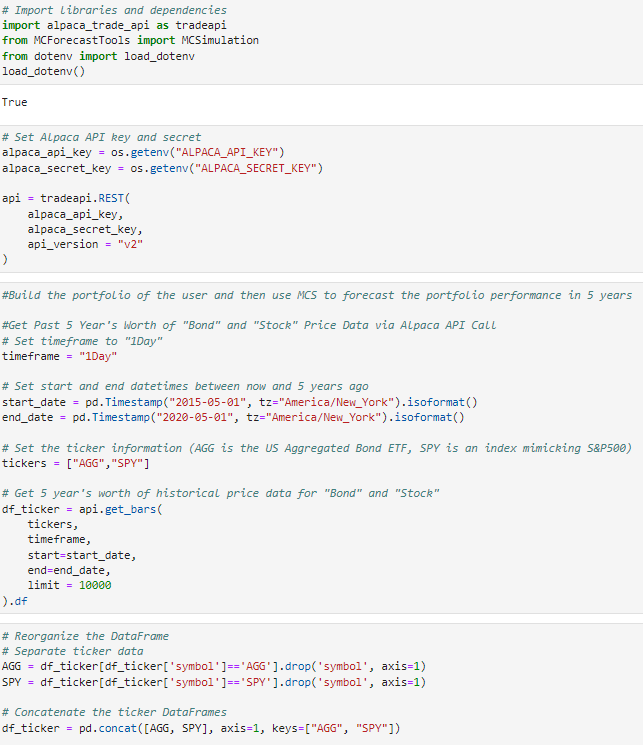

### *MCS Configuration*
The MCS is configured to forecast the return of portfolio constructed by AGG and SPY. The % of each financial asset are calculated by the users' age and risk preference as mentioned previously. This MCS will result a forecasted cumulative return for the next five years.

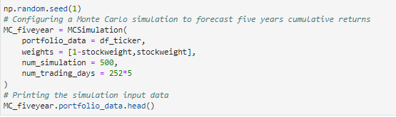

### *Applied financial formulas*
After the cumulative return figure is obtained, the annualised return is then calculated based on the formula as below:

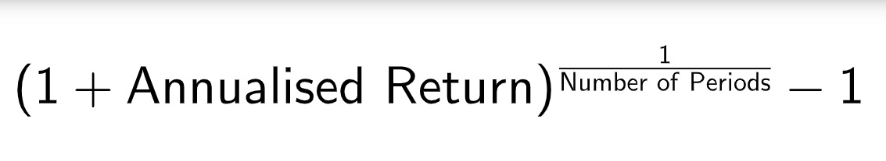

There are few of necessary assumptions in order to get the forecasted retirement fund of the users:
+ The users contribute a same amount of annual investment.
+ The rate of interest is equal to the calculated annualised interest, derived from average cumulative return from MCS.
+ The users hold exactly the same portfolio for the whole investing period.

The number of periods is calculated from the current year to the desired retirement year.

Finally, the forecasted retirement fund is calculated by using future value of an ordinary annuity formula:

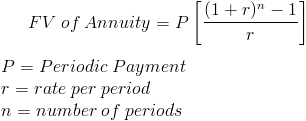

## **3. Demonstration with scenarios**
Below is a demonstration of the result. The input data is from a fictional user who has the following information:

+ Age: 48
+ Desired retirement age: 60
+ Annual investment amount: $5,000

The program will test different risk preferences to understand how it affects the final result.

## ***Scenario 1 - High risk preference***

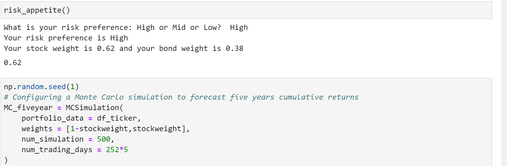
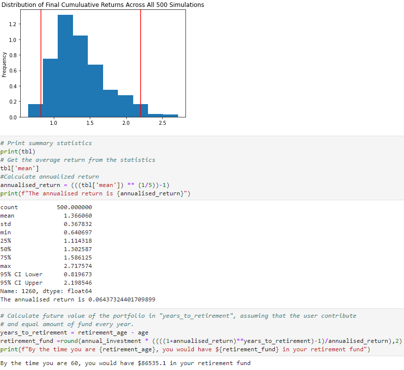

### - 62 % of investment portfolio is stocl, 38 % is bond. 
### - 6.4 % investment return rate 
### - Receive $ 86,535.1 at age of 60

 

## ***Scenario 2 - Mid risk preference***
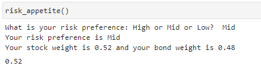
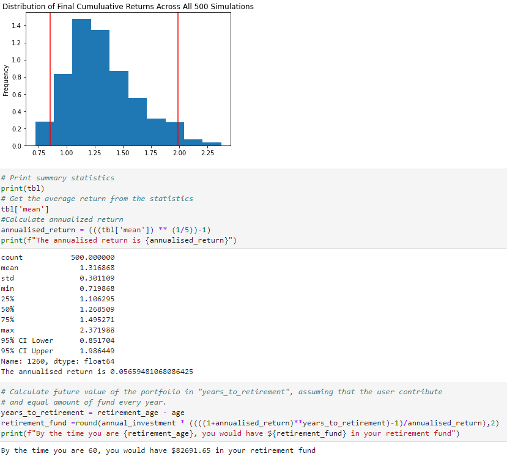

### - 52 % of investment portfolio is stocl, 48 % is bond. 
### - 5.6 % investment return rate 
### - Receive $ 82,691.65 at age of 60

 

## ***Scenario 3 - Low risk preference***
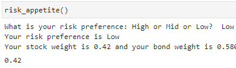
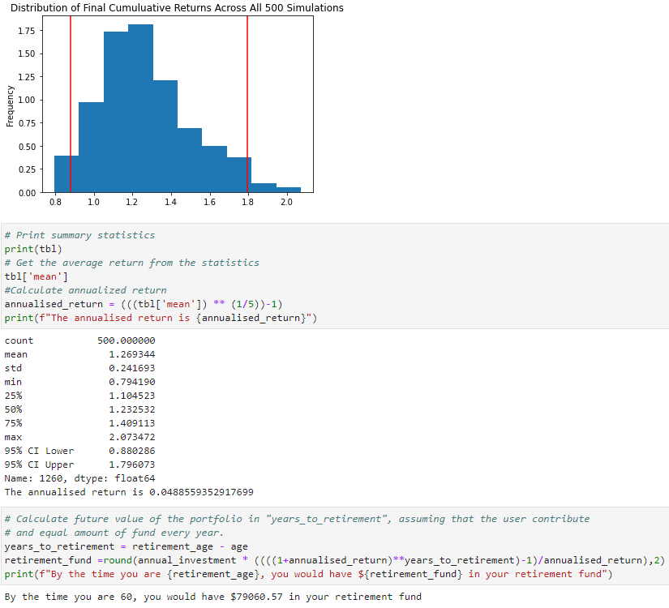

### - 42 % of investment portfolio is stocl, 58 % is bond. 
### - 4.89 % investment return rate
### - Receive $ 79,060.57 at age of 60

# Reference
+ Brock, C., 2022. The Motley Fool. [online] fool.com. Available at: <https://www.fool.com/retirement/strategies/asset-allocation-by-age/#:~:text=The%20Rule%20of%20100%20determines,people%20are%20generally%20living%20longer.> [Accessed 13 August 2022].