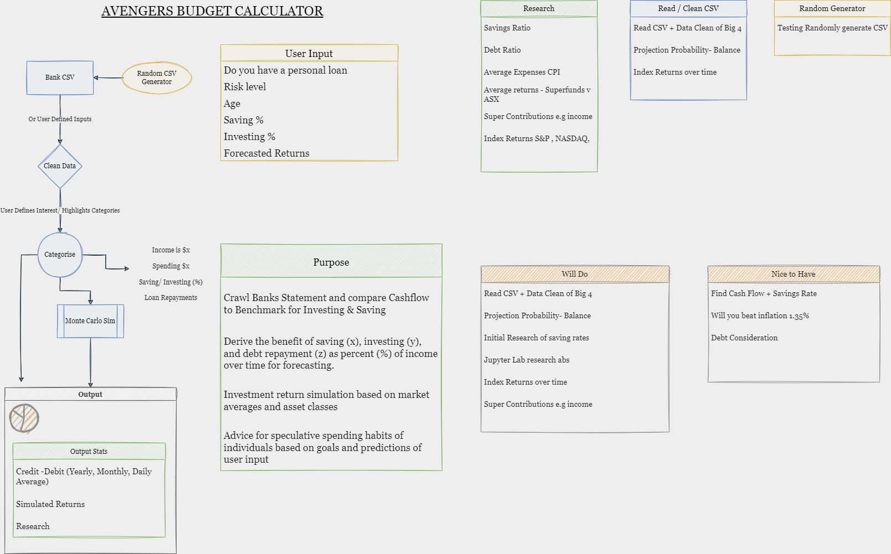

# Executive summary : 

## The Avengers Budget Calculator | Tool to encourage Saving & Investing

## "What if I put my savings into investment?"

This project analyse an individual's saving data from their bank statements. Through FinTech (API, Monte-Carlos Stimulus, Python etc), we can provide insights about return on investment on your savings. For example, how do you compare with people with similar age. 

## Technical 

### Source of data: 

### Data sorting, cleaning and exploration: 

Processing data is essential as users are with different banks, thus have different bank statements (NAB, ANZ, CBA, Westpac). 

Example of CBA bank statement: 

Example of ANZ bank statement: 

Data was extracted from bank statements and used to build dataframe. 

