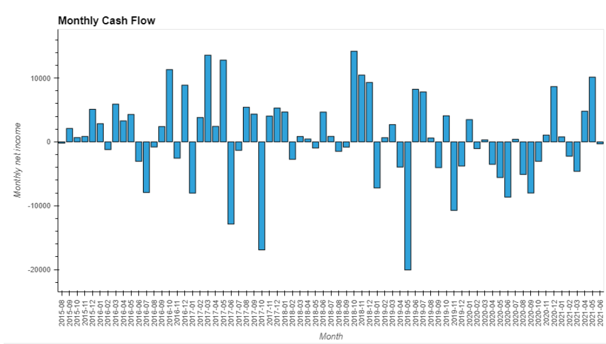
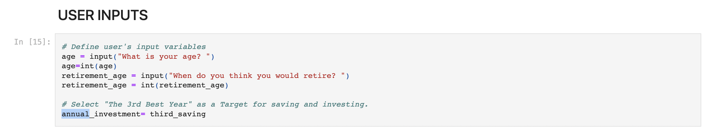
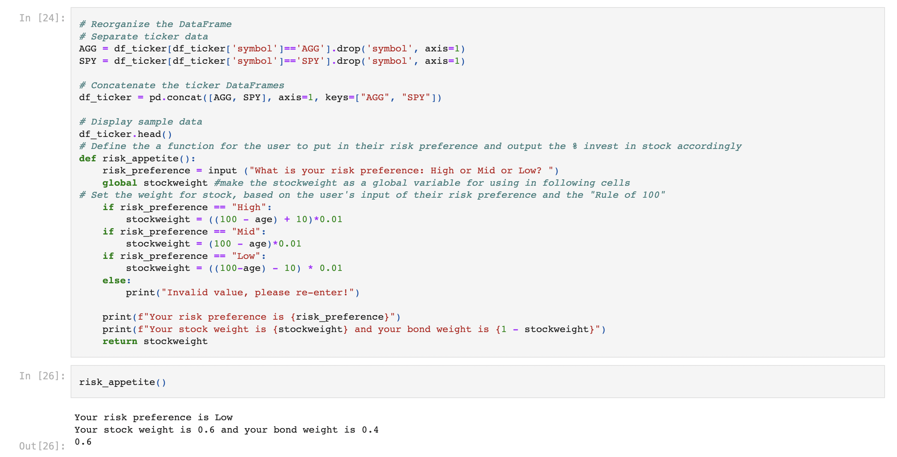
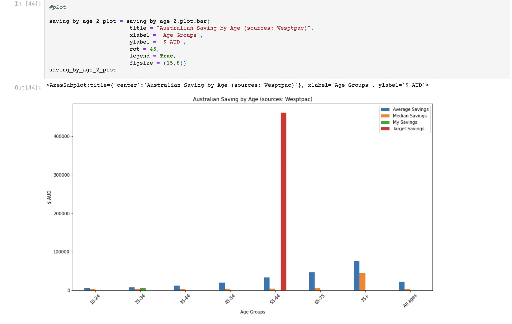

# Quick Audit | Budget Calculator 

 

### `"What if I Invested my Savings?"`

 

 

 

# Overview: 

This project assess an individual's spending and saving using their bank statements. 

Using Financial technology including API, Monte-Carlos Stimulus, Python etc, the program can provide insights about:

- Personal Spending Habits
- Speculative Investment Return on personal saving 
- How does your finances compare with inflation rate 
- How do you compare with others within your age group

## Flow Chart

 

 

 

# Technical Specifications

`Program uses multiple Python libraries including Faker, Pandas, Datetime, OS, Numpy and Pathlib `

## Source of data: 

1. CSV Data extracted from user's bank statements. 

2. Analysis of historical data from S&P 500 and Aggregate Bond Index ETF,  obtained from Alpaca. 

    The data were then used for Monte-Carlos Simulations. 

    _Time period from 2017-05-01 to 2020-05-01_

3. Inflation data (Consumer Price Index, **CPI**) was obtained from Australian Bureau of Statistics (ABS). 

    Saving-By-Age data was obtained from Westpac. 

    _Time period for CPI was from Jun-2012 to Jun-2022._

    _Saving_By_Age was taken at 31-12-2020_

---

## Data sorting, Cleaning and Exploration: 

Processing and cleaning data is essential as users are with different banks, thus have different bank statement formats (NAB, ANZ, CBA, Westpac). 

The program models the "BIG 4" banks, as they are the prevelant financial institutions in Australia.

### Example of CBA bank statement: 

### Example of ANZ bank statement: 

### Example of Standardised DataFrame After Data Clean

---

## Create User Summary through Data Story

The program makes it simple to see your expenditure and visualise your cashflow

## Show Investment Simulation to Encourage Saving and investing

`Insert chart of Monte carlo sim (Slice for period until retirement)`

## Compare Savings to the Average Australian

 

 

 

# Instructions:

## 1. Download bank statements as CSV

### Below are detailed instructions to download your CSV bank statements. It is recommnded that you download a year worth of recent data:

- [NAB](https://www.nab.com.au/personal/customer-support/using-online-banking-tools-to-make-tax-time-easier)
- [WESTPAC](https://www.westpac.com.au/business-banking/online-banking/support-faqs/export-detailed-transaction-history/)
- [ANZ](https://help.anz.co.nz/app/answers/detail/a_id/767/~/exporting-transaction-history)
- [COMMBANK](https://www.commbank.com.au/business/online-business-services/commbiz/faqs/how-to-export-transactions.html)

---

  

## 2. Set the file loaction for your csv file and input the basic parameters

 ### 1. Set up file path to access your bank CSV 

 

### 2. Input you age, retirement age and risk appetite

 

### Code for input current age and expected retirement age
 

 

### 3. Customise you investment return 

### Input risk appetite

 

## 4. View the results 

 

### Personal bankstatement

 

### Monthly cash flow

 

### User's saving in comparison to saving of his/her age group

source: [Westpac](https://www.westpac.com.au/personal-banking/solutions/budgeting-and-savings/savings/savings-by-age/)

 

### Annualised return on investment in comparison to inflation rate 

