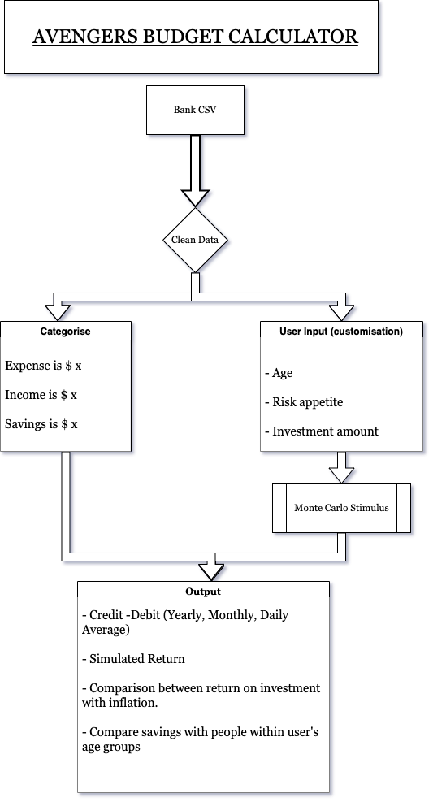

# Quick Audit | Budget Calculator 

--

### `"What if I Invested my Savings?"`

--

# Overview: 

This project assess an individual's spending and saving using their bank statements. 

Using Financial technology including API, Monte-Carlos Stimulus, Python etc, the program can provide insights about:

- Personal Spending Habits
- Speculative Investment Return on personal saving 
- How does your finances compare with inflation rate 
- How do you compare with others within your age group

## Flow Chart

# Technical Specifications

`Program uses multiple Python libraries including Faker, Pandas, Datetime, OS, Numpy and Pathlib `

## Source of data: 

1. Data extracted from user's bank statements. 

2. Analysis of historical data from S&P 500 and Aggregate Bond Index ETF,  obtained from Alpaca. 

    The data were then used for Monte-Carlos Simulations. 

    _Time period from 2017-05-01 to 2020-05-01_

3. Inflation data (Consumer Price Index, **CPI**) was obtained from Australian Bureau of Statistics (ABS). 

    Saving-By-Age data was obtained from Westpac. 

    _Time period for CPI was from Jun-2012 to Jun-2022._

    _Saving_By_Age was taken at 31-12-2020_

---

## Data sorting, Cleaning and Exploration: 

Processing and cleaning data is essential as users are with different banks, thus have different bank statement formats (NAB, ANZ, CBA, Westpac). 

The program models the "BIG 4" banks, as they are the prevelant financial institutions in Australia.

### Example of CBA bank statement: 

### Example of ANZ bank statement: 

### Example of Standardised DataFrame After Data Clean

