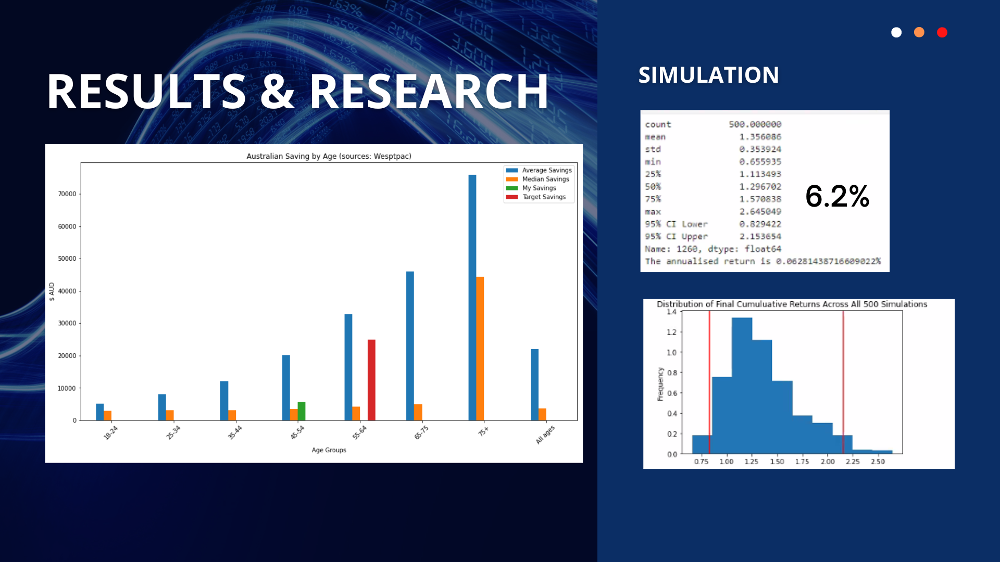

# Quick Audit | Budget Calculator 

--

### `"What if I Invested my Savings?"`

--

# Overview: 

This project assess an individual's spending and saving using their bank statements. 

It is split into 4 sections Accordingly:

1. CSV Reader for Scrubbing and sorting Data for human readability
2. CSV Generator - Creates fake data for testing the program
3. Monte Carlo Simulation - Forecasts potential future Market Returns of US Stocks and Bonds
4. Research - Compare findings with Australian Benchmark 

## Outcome 

Using Financial technology including API, Monte-Carlos Stimulus, Python etc, the program can provide insights about:

- Personal Spending Habits
- Speculative Investment Return on personal saving 
- How do you compare with others within your age group

## Flow Chart

# Technical Specifications

`Program uses multiple Python libraries. Dependancies include Faker, hvplot and matplotlib`

# Instructions:

## Part 1 - Analyze Cash Flow

### 1. Download bank statements as CSV

### Below are detailed instructions to download your CSV bank statements. It is recommnded that you download a year worth of recent data:

- [NAB](https://www.nab.com.au/personal/customer-support/using-online-banking-tools-to-make-tax-time-easier)
- [WESTPAC](https://www.westpac.com.au/business-banking/online-banking/support-faqs/export-detailed-transaction-history/)
- [ANZ](https://help.anz.co.nz/app/answers/detail/a_id/767/~/exporting-transaction-history)
- [COMMBANK](https://www.commbank.com.au/business/online-business-services/commbiz/faqs/how-to-export-transactions.html)

### 2. Set the file loaction for your csv file, and Run the CSV_reader

 Now you know your cash flow, you are better prepared to define your savings and investing goals 

## Results 

### Weekly Cash Flow Grouped By Year

The program makes it simple to see your expenditure and visualise your cashflow

---

## Part 2 - Forecast Returns

### 2.1 Open the MC_Forecasting tool

### 2.2 Input you current age and retirement age 

### 2.2 Input Yearly Investment

## Results 

### Compare Savings to the Average Australian

#### Personal bankstatement

- Shows top three savings
- Shows average yearly, monthly and weekly savings

### Show Investment Simulation

#### Encourage Saving and investing

---

## Data sorting, Cleaning and Exploration: 

Processing and cleaning data is essential as users are with different banks, thus have different bank statement formats (NAB, ANZ, CBA, Westpac). 

The CSV_Generator program models the "BIG 4" banks, as they are the prevelant financial institutions in Australia.

The Fake CSV's are used to demonstrate the application.

### Example of CBA bank statement: 

### Example of ANZ bank statement: 

### Example of Standardised DataFrame After Data Clean

---

# Demo

## Source of data: 

1. CSV Data extracted from user's bank statements. 

2. Analysis of historical data from S&P 500 and Aggregate Bond Index ETF,  obtained from Alpaca. 

    The data were then used for Monte-Carlos Simulations. 

    _Time period from 2017-05-01 to 2020-05-01_

3. Inflation data (Consumer Price Index, **CPI**) was obtained from Australian Bureau of Statistics (ABS). 

    Saving-By-Age data was obtained from Westpac. 

    _Time period for CPI was from Jun-2012 to Jun-2022._

    _Saving_By_Age was taken at 31-12-2020_

---
